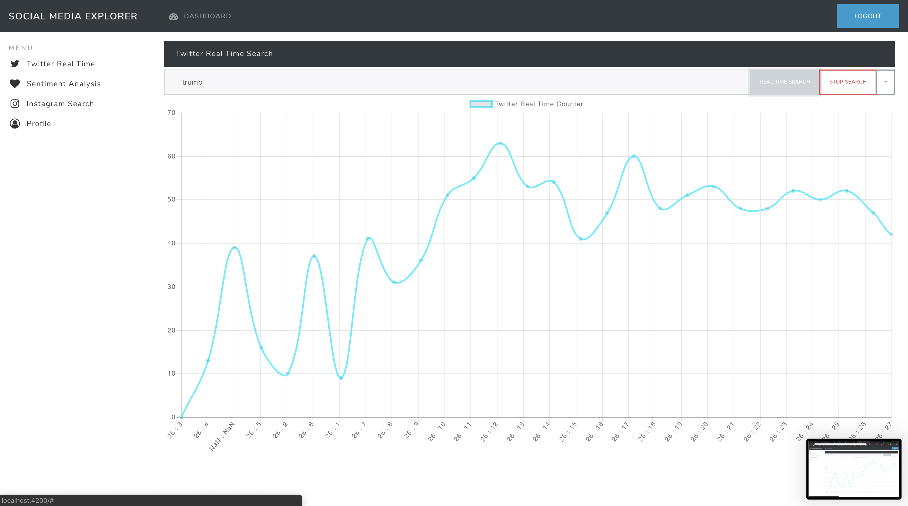
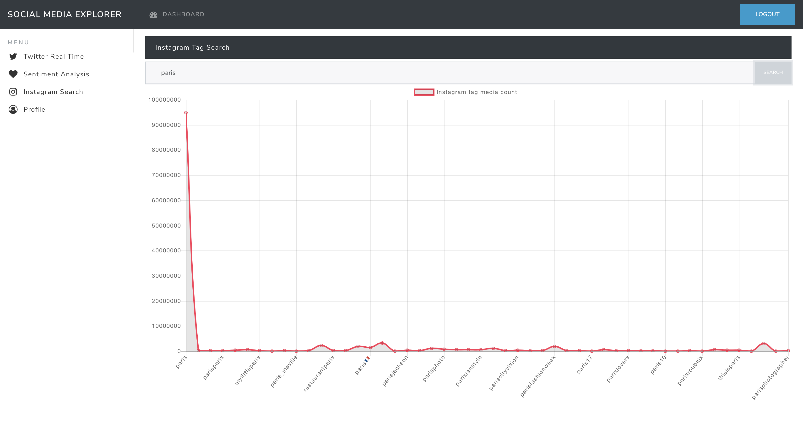

# socialMediaExplorer

university project





### After install we need some npm utils so open the cli and type the following

```sh
npm install -g @angular/cli
npm install -g nodemon
npm install -g sequelize-cli
```

### Config the database

```sh
docker run --name postgresdb -p 32768:5432 -d postgres
docker exec -it postgresdb psql --username postgres -c \ "CREATE DATABASE devdb OWNER postgres;"
docker exec -it postgresdb psql --username postgres -c \ "GRANT ALL PRIVILEGES ON DATABASE devdb TO postgres;"
```
